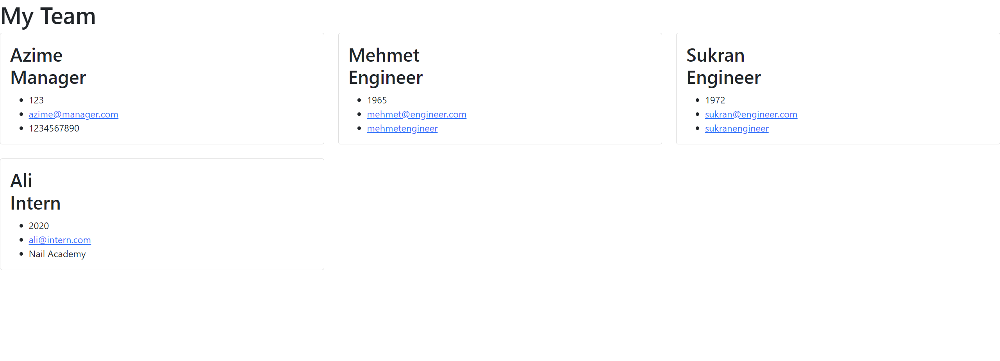

# team-profile-generator

## Description

The team profile generator creates an HTML file with the information for every member of team, which is gathered through user input in the command-line application. You are able to add one manager and as many engineers and interns as you'd like.

## Table of Contents

- [Installation](#installation)
- [Usage](#usage)
- [Credits](#credits)
- [License](#license)

## Installation

- inquirer version 8.2.4
- jest version 24.8.0 (this is need for the testing)

## Usage

Answer questions through the command-line application and the HTML file will be created when finished.

## Credits

- Rutgers University Coding Bootcamp

## License

N/A
